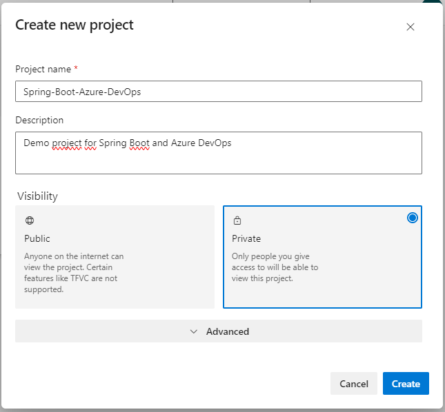
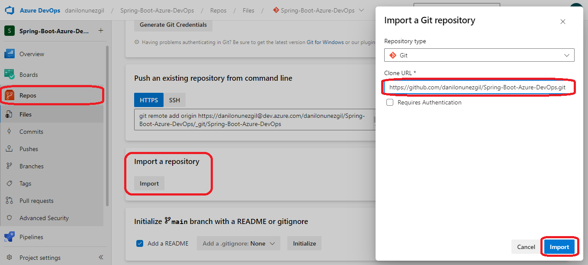
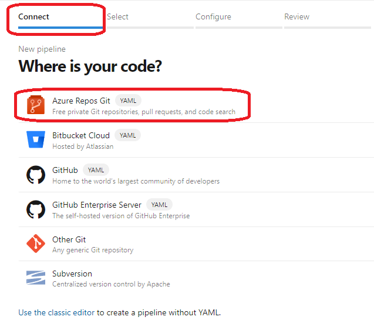
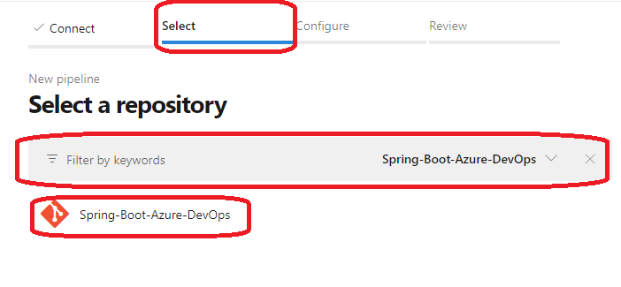
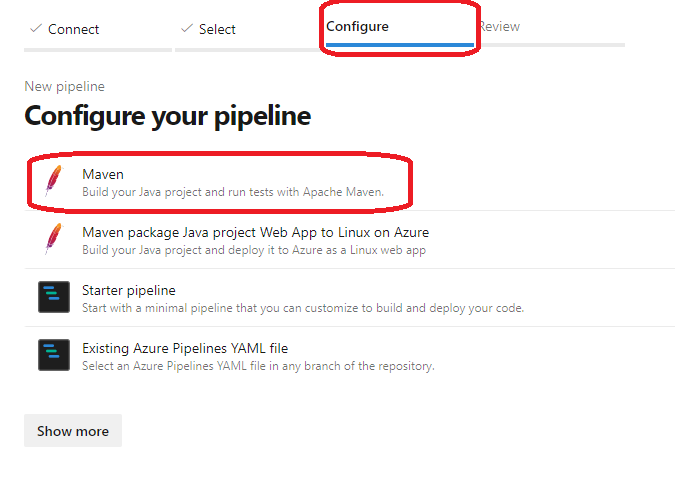
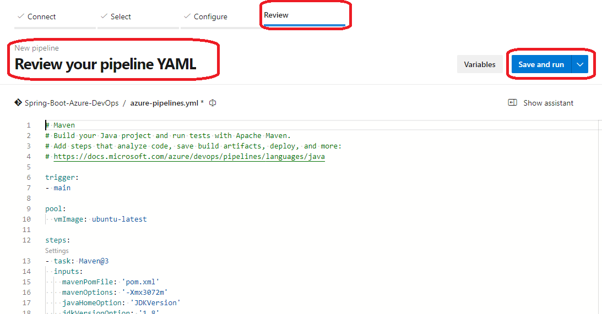
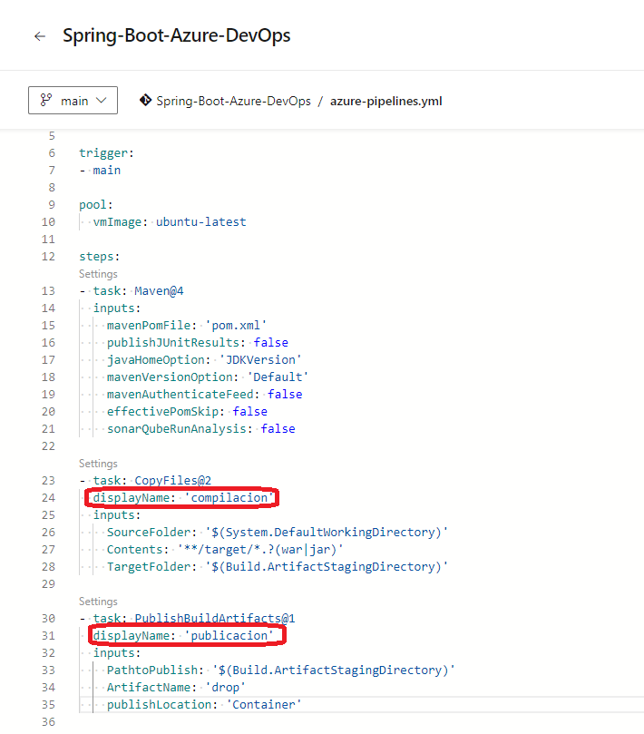
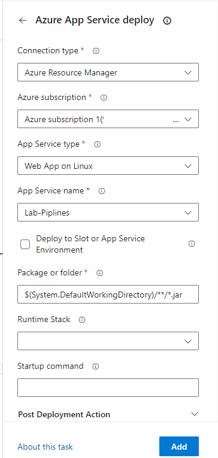
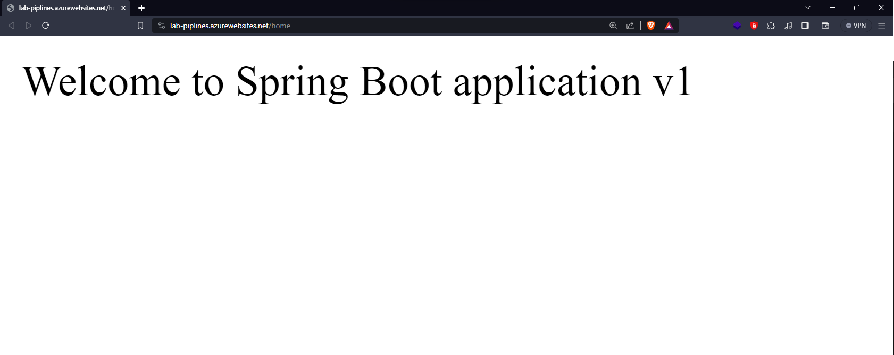

# Spring Boot - Azure DevOps 

This repository provides a quick guide on how to set up and run a pipeline in Azure DevOps of a Spring Boot project

## Index

1. [Prerequisites](#prerequisites)
2. [Local Execution](#local-execution)
3. [Azure DevOps Config](#azure-devops-configuration)


## Prerequisites

You must have the following:

- Java 8 or higher 
- Maven
- Code editor of your choice.
- Azure DevOps Account

## Local Execution

To run the application locally, follow these steps:

1. Clones the repository:

    ```bash
    git clone https://github.com/danilonunezgil/Spring-Boot-Azure-DevOps.git
    ```

2. Navigate to the project directory:

    ```bash
    cd Spring-Boot-Azure-DevOps
    ```

3. Run the application:

    ```bash
    ./mvnw spring-boot:run
    ```

4. The application will be available at 
   ```bash
   [http://localhost:8080/home](http://localhost:8080/home)
   ```

## Azure DevOps Configuration

1. Create a new project in Azure DevOps



2. In "Repos" of Azure DevOps import the GitHub repository [repository-example](https://github.com/danilonunezgil/Spring-Boot-Azure-DevOps.git)



3. Create pipeline to the Spring Boot project









4. Run the pipeline


5. Modify the azure-pipelines.yml as necessary



6. Add Azure App Service Deploy



7. Run again the pipeline


8. Verify the program deployed



8. Make a change in the code to view in the deploy


8. Upload the change to the main branch


9. Verify changes made to the deployment
